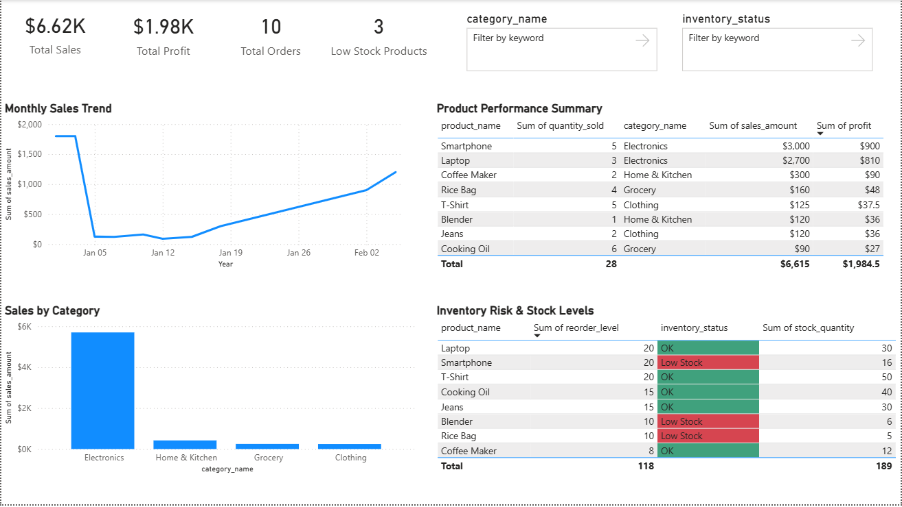

# 📊 Retail Sales & Inventory Analysis

## 🔍 Project Overview
This project focuses on analyzing retail sales and inventory data to uncover revenue trends, product performance, and inventory risks. The goal is to support data-driven decision-making for sales optimization and effective stock management.

The project demonstrates an end-to-end data analytics workflow using SQL, Python, and Power BI.

---

## 🛠️ Tech Stack
- **SQL (MySQL)** – Database design, joins, aggregations, and analysis
- **Python (Pandas, SQLAlchemy)** – Data extraction, cleaning, and feature engineering
- **Power BI** – Interactive dashboards, KPIs, and data visualization

---

## 📂 Data Pipeline
1. Designed a normalized relational database using MySQL
2. Inserted realistic retail sales and inventory data
3. Extracted data from MySQL into Python using SQLAlchemy
4. Cleaned and merged datasets using Pandas
5. Created business metrics such as profit and inventory status
6. Exported a BI-ready dataset for visualization
7. Built an interactive Power BI dashboard

---

## 📈 Key Insights
- Identified top-selling and most profitable products
- Analyzed monthly sales trends
- Compared sales performance across product categories
- Highlighted low-stock products using reorder thresholds
- Monitored inventory risks through conditional formatting

---

## 📊 Power BI Dashboard

---

## 🚀 Outcome
This project demonstrates a complete analytics workflow—from database design and data processing to business-focused visualization—making it well-suited for Data Analyst and Business Analyst portfolios.

---

## 📌 Skills Demonstrated
- SQL joins, aggregations, and relational modeling
- Python data pipelines with Pandas and SQLAlchemy
- Feature engineering and data cleaning
- Power BI dashboard design with KPIs and conditional formatting
- Business-focused data storytelling

